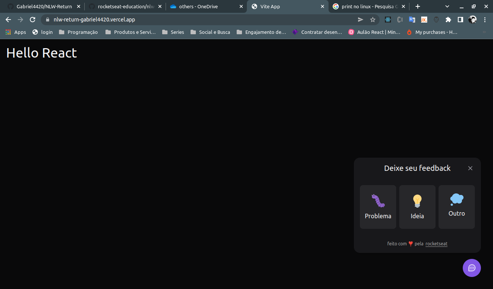

<h1 align="center">
  NLW Return Widget
</h1>

<p align="center">
   

  

  

  <br>
  
  <a href="https://www.codacy.com/manual/Gabriel4420/NLW-Return?utm_source=github.com&amp;utm_medium=referral&amp;utm_content=Gabriel4420/NLW-Return&amp;utm_campaign=Badge_Grade">
    
  </a>
  
  


  <a href="https://www.linkedin.com/in/gabriel-rodrigues-perez-2069b072/">
    
  </a>
</p>

---

<p align="center">
  
</p>

---

# Indice

- :rocket: [Sobre o Projeto](#rocket-sobre-o-projeto)
- 👨‍💻️ [Tecnogias utilizadas](#%EF%B8%8F-tecnogias-utilizadas)
- 📦️ [Como utilizar o projeto](#%EF%B8%8F-como-utilizar-o-projeto)
---

## :rocket: Sobre o Projeto

O projeto da NLW Return, é um widget de sugestões, feedbacks de problemas e ideias.

---

## 👨‍💻️ Tecnogias utilizadas

O projeto foi desenvolvido utilizando as seguintes tecnologias:

- [typescript](https://www.typescriptlang.org/)
- [NextJS](https://nextjs.org/)
- [ReactJS](https://pt-br.reactjs.org/)
- [Prisma](https://www.prisma.io/)
- [nodemailer](https://nodemailer.com/about/)


### Dependências

  - [tailwind](https://tailwindcss.com/)
  - [axios](https://axios-http.com/ptbr/docs/intro)
  - [html2canvas](https://www.npmjs.com/package/html2canvas)
  - [phosphor-react](https://phosphoricons.com/)
  - [@headlessui](https://headlessui.dev/)


### Padronização de código

  - [ESLint](https://eslint.org/)
  - [Prettier](https://prettier.io/)
  - :mouse: [Editor Config](https://editorconfig.org/)

### IDE

  - [Visual Studio Code](https://code.visualstudio.com/)

---

## 📦️ Como utilizar o projeto

Para copiar o projeto, utilize os comandos:

```bash
  # Clonar o repositório
  ❯ git clone https://github.com/Gabriel4420/NLW-Return.git

  # Entrar no diretório frontend
  ❯ cd web

   # Entrar no diretório backend
  ❯ cd server
```
Para instalar as dependências e iniciar o projeto, você pode utilizar o npm ou yarn:

**Utilizando Yarn**

```bash
  # verificar as dependências
  ❯ yarn 
  
  # Iniciar o projeto
  ❯ yarn dev
```

**Utilizando yarn**

*PS: utilize o npm, para atualizar as dependências, tome cuidado, pois dependendo da versão da dependência, pode ser que o projeto não funcione como o esperado.*

```bash
  # verificar as dependências
  ❯ npm install 
  
  # Iniciar o projeto
  ❯ npm run dev
```

---

<h4 align="center">
  Feito com ❤️ por Gabriel Rodrigues 👋️ <a href="mailto:gabriel_rodrigues_perez@hotmail.com">Entre em contato!</a>
</h4>

<p align="center">

  <a href="https://www.linkedin.com/in/gabriel-rodrigues-perez-2069b072/">
    
  </a>
  <a href="https://www.facebook.com/gabriel.rodrigues.perez">
    
  </a>
  <a href="https://www.instagram.com/gabriel_rodrigues_perez/">
    
  </a>
  
  
</p>